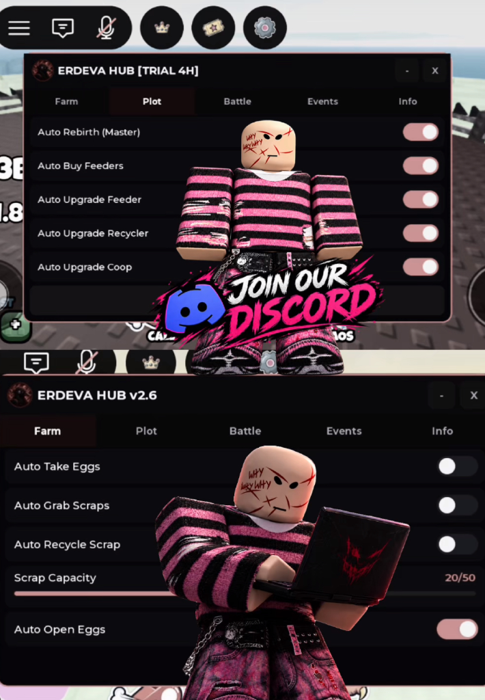

# ERDEVA HUB v2.6

> Grow a Chicken Fighter Automation Hub

## Overview & GUI Preview

## Features

### 🌾 Farm
- **Auto Take Eggs**: Automatically collects eggs from incubators/nest eggs and claims dust shop rewards.
- **Auto Grab Scraps**: Automatically scans and collects the nearest scrap plates in the arena or pit area.
- **Auto Recycle Scrap**: Automatically walks to the recycler pad and deposits scrap plates once your capacity is full.
- **Scrap Capacity Slider**: Customizable scrap carry limit (1 – 50 plates, default: 20).
- **Auto Open Eggs**: Automatically hatches and opens eggs periodically.

### 🏡 Plot
- **Auto Rebirth (Master)**: Automatically detects the Rebirth alert indicator (`!`), executes rebirth smoothly, and coordinates essential automation flags.
- **[LOCK] Set Recycler Pad**: Locks your current plot's recycler coordinates to ensure precise pathfinding.
- **Auto Buy Feeders**: Automatically purchases new feeder generators across all available slots (Slots 1–8).
- **Auto Upgrade Feeder**: Automatically upgrades feeder speed across all generator slots (Slots 1–6).
- **Auto Upgrade Recycler**: Automatically upgrades the recycler machine's speed and level.
- **Auto Upgrade Coop**: Automatically expands coop capacity.

### ⚔️ Battle
- **Auto Start Tower**: Automatically sends your chicken to the Frontier Tower with local player event filtering and precise cooldown management.
- **Auto Arena**: Automatically clicks 'Go to Battle' and enters Arena/PvP matches continuously.
- **Auto Close No Thanks**: Automatically bypasses defeat and post-round popups ("No Thanks" / "Keep Climbing") to prevent stuck states.
- **Auto Close Popups**: Automatically closes insufficient fund popups ("Not Enough Cash").
- **Send Chicken to Pit**: Quick-action button to manually deploy your chicken into the Chaos Pit.

### 🛸 Events
- **Auto UFO**: Detects live UFO events in the server and sends your chicken into the Pit/Chaos for event duration.
- **Auto Golden Goose**: *(Coming Soon)*
- **Auto Chicken Boss**: *(Coming Soon)*

### ℹ️ Info & Dashboard
- **Live Scrap Tracker**: Displays real-time scrap capacity and carried count.
- **Account & License Monitor**: Shows player credentials, VIP license status, or remaining trial duration countdown.
- **One-Click Discord Copy**: Instant button to copy the official Discord support link to your clipboard.

## Key System

Keyless / License System — Enter your license key or access the built-in Free Trial directly through the loader.

## Usage

1. Launch Roblox and join **Grow a Chicken Fighter**.
2. Execute the script using your preferred supported executor.
3. The **ERDEVA HUB v2.6** interface will appear on your screen.
4. Select your desired tab and toggle on the features you want.

## Disclaimer

This project is provided for educational and testing purposes only. Use third-party scripts and automation tools at your own risk. Game updates may alter remote signatures or break functionality.

## Version

Current version: `v2.6`

---

Made with ❤️ by **ERDEVA**
