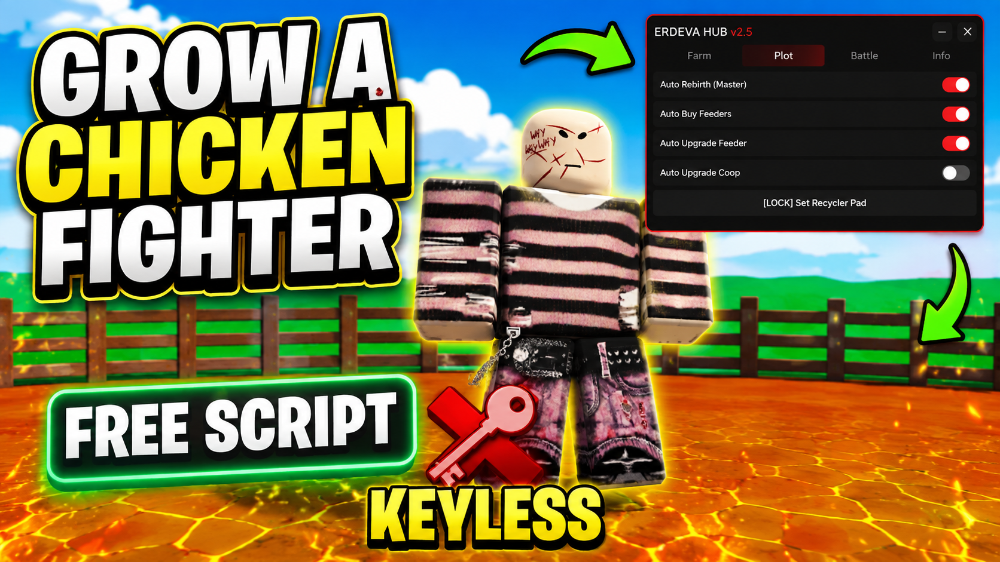

# ERDEVA HUB v2.5

> Grow a Chicken Fighter Automation Hub

## Thumbnail

## Features

### Farm
- Auto farming features
- Simple and clean controls

### Plot
- Auto Rebirth (Master)
- Auto Buy Feeders
- Auto Upgrade Feeder
- Auto Upgrade Coop
- [LOCK] Set Recycler Pad

### Battle
- Battle-related automation and tools

### Info
- Hub information and updates

## Key System

Keyless — no key required.

## Usage

1. Open Roblox and join Grow a Chicken Fighter.
2. Run the hub using your preferred supported executor.
3. Open ERDEVA HUB v2.5.
4. Select a tab and enable the features you want.

## Disclaimer

This project is provided for educational and testing purposes. Use third-party scripts or automation tools at your own risk. Game updates may cause features to stop working.

## Version

Current version: `v2.5`

---

Made by ERDEVA
